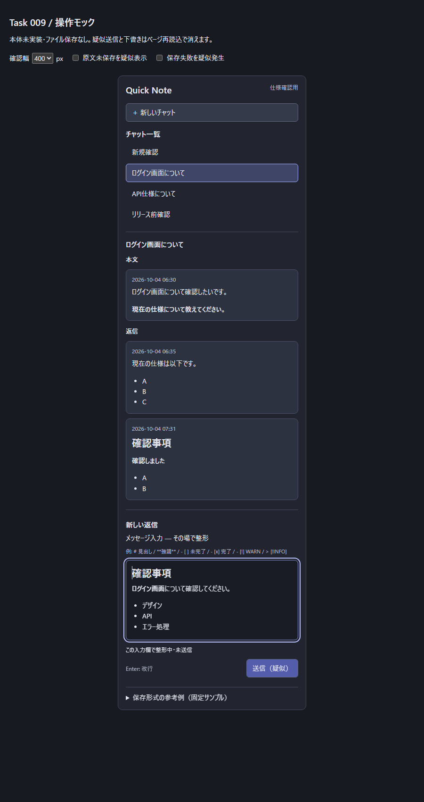

# Task 009 — 使い方と画面確認

**状態**: 仕様確認用。本体はまだ旧 UI のままです。以下は009実装後の予定する体験です。

## 最初に確認すること

「Markdown を書く → 送信しなくても整形結果を見る → 送信して会話に追加する」が中心です。
チャット一覧・会話・入力欄は同じサイドパネル内にあります。
**入力欄そのものがリアルタイムに整形され、整形された文章をその場で直接編集します。**
別枠のリアルタイムプレビューは設けません。以前の「入力とプレビューを並べる」モックは取り下げました。

## 画面イメージ

```text
┌─────────────────────────────────┐
│ Quick Note                      │
│ ＋ 新しいチャット               │
├─────────────────────────────────┤
│ チャット一覧                    │
│ ● ログイン画面について          │
│   API仕様について               │
│   リリース前確認                │
├─────────────────────────────────┤
│ ログイン画面について            │
│ 本文                            │
│ ┌─────────────────────────────┐ │
│ │ 2026-10-04 06:30             │ │
│ │ ログイン画面について確認。   │ │
│ └─────────────────────────────┘ │
│ 返信                            │
│ ┌─────────────────────────────┐ │
│ │ 2026-10-04 06:35             │ │
│ │ 現在の仕様は以下です。       │ │
│ │ • A                         │ │
│ │ • B                         │ │
│ └─────────────────────────────┘ │
│ 新しい返信 / その場で整形       │
│ ┌─────────────────────────────┐ │
│ │ 確認しました（強調表示）    │ │
│ │ • A                         │ │
│ │ • B                         │ │
│ └─────────────────────────────┘ │
│ Enter: 改行              [送信] │
└─────────────────────────────────┘
```

狭い幅でも縦に配置します。コード・表だけを内部で横スクロールし、入力欄や送信操作は隠しません。
配色・余白・カード形状はモック上の提案で、機能要件ではありません。

### モックの実画面

見出し・強調・リストが、送信前に入力欄の中で整形されます。この表示を直接編集します。



長文・URL・コード・表の確認画面: [280px](mock/screenshots/chat-280.png) /
[400px](mock/screenshots/chat-400.png) / [800px](mock/screenshots/chat-800.png)。
画像は仕様確認用モックのスクリーンショットであり、VS Code本体の画面ではありません。

## 予定する使い方

1. 作業フォルダーを開き、Quick Note のサイドパネルを表示します。
2. 「新しいチャット」を選び、タイトルと本文を入力します。入力した場所で見出し・強調・リストへ整形されます。
3. 見出し・強調・リストを確認して「送信」を押します。この時点で初めて1つの `.md` ファイルを作成し、一覧へ追加します。
4. チャットを選択し、「新しい返信」に Markdown を入力します。Enter は改行であり、送信しません。
5. 送信すると同じファイルの返信セクションへ追加します。別のチャットへ移っても下書きは混ざりません。
6. 原文を直接変更した場合、未保存でも一覧タイトル・スレッドへ反映し、未保存状態を表示します。原文を保存・破棄するまでチャットからの送信を止めます。
7. 保存失敗・競合では成功表示を出さず、下書きを残します。入力を退避して、原文の状態を確認してから再試行します。

## 操作できるモックを開く

リポジトリのルートで実行します。既存の依存関係と安全な Markdown renderer を使い、新しい parser や CDN は使いません。

```powershell
npm.cmd ci
npm.cmd run compile-tests
node specs\009-realtime-markdown-chat\mock\server.cjs
```

ブラウザで `http://127.0.0.1:4319` を開きます。macOS／Linux は `npm.cmd` を `npm` に読み替え、
パスには `/` を使います。停止は起動した端末で Ctrl+C。別ポートは `--port=4320` で指定できます。

モック確認はまず次の順で行ってください。

1. ログイン画面の返信へ `**確認しました**` を入力し、最後の `**` を入力した時点で入力欄内の文字が強調されることを確認します。続けて文中をクリックし、同じ場所で追記できます。
2. 「送信（疑似）」を押して会話への追加を確認します。次に「新しいチャット」でタイトルと本文を入力して疑似送信します。
3. 幅を280px・400px・800pxへ切り替え、コード・表・長い文章で見た目を確認します。
4. 「原文未保存を疑似表示」を有効にして送信停止を確認し、解除します。
5. 「保存失敗を疑似発生」を有効にして送信し、入力が残ることを確認します。解除して再試行できます。
6. 「保存形式の参考例」で、スレッドと Markdown の関係を確認します。

## モックと本体の違い

### 状態付き項目・注意書き・削除

入力欄へ次を貼り付けると、チェック表示、状態ラベル、INFO／WARNブロックがその場に表示されます。
通常の項目本文は14px、見出しはレベルに応じ21／18／16／15／14／13pxとし、書式を区別します。

```markdown
# 見出し

- [ ] 未完了
- [x] 完了
- [i] IMP（重要）
- [!] WARN（注意）
- [n] Note（参考）
- [-] Skip（対応不要）

> [!INFO]
> 補足情報です。

> [!WARN]
> 注意事項です。
```

モックのチェック表示は状態を示すもので、クリックによる状態変更はまだ提供しません。
本体009では入力欄と送信済みメッセージの両方でクリック・キーボード切替を提供する仕様に確定しました。
入力欄では下書きだけを変更し、送信済み側は対象項目だけをファイルへ安全に保存します。
原文未保存・競合・読み取り専用・保存失敗では保存を停止し、理由を示します。
画面例: [チェック・状態・INFO／WARNの入力欄](mock/screenshots/chat-states.png)。
注意書きはWARNのほかWARNING・CAUTION、INFOのほかNOTE・IMPORTANT・TIPも表示します。
通常の引用、コード内の記法は注意書きへ変換しません。

Backspaceは通常の文字削除に加え、見出し先頭で段落へ戻り、チェック項目先頭で状態解除、
続くBackspaceで箇条書き解除を行います。注意書き本文先頭では引用から退出し、
段落先頭では前段落と結合します。全選択からのBackspaceは装飾を含めて全消去します。
削除後もその場所で入力を続けられます。

本体のEnterは見出し末尾で通常段落へ、リスト末尾で次項目へ、チェック項目末尾で未完了の次項目へ進みます。
注意書き内は次行へ進み、空項目・空行のEnterで書式から退出します。
Shift+Enterは同じ書式内の改行です。いずれも送信しません。
これらのEnter規則は確定仕様であり、現在のモックで全ケースが実装済みという意味ではありません。

| 内容 | モック | 本体に必要なこと |
|---|---|---|
| Markdown 描画 | 既存 `src/rendering.ts` の `renderSafeMarkdown` を使用 | 同じ安全性をチャットへ接続 |
| その場の編集 | 専用の試作入力欄で見出し・強調・リスト等を直接編集 | 任意の対応済み記法を損失なく編集・復元し、選択・履歴・IMEを保護 |
| 送信 | ページ内の会話へ追加するだけ | 対象ファイルへ競合を検出して保存 |
| 下書き | ページを開いている間だけ、チャット別に保持 | パネル再表示・再起動でも復旧 |
| 原文変更 | 送信停止と状態表示だけを疑似再現 | 文書更新・保存・破棄・競合を実検知 |
| 保存失敗 | チェックボックスで疑似発生 | 権限・ディスク・競合等の実エラーを処理 |
| 原文例 | 固定の参考例を表示 | 本文内見出しとの境界規則を計画で確定 |
| 表示環境 | ローカルブラウザ | VS Code テーマ、Webview、支援技術で検証 |

**モックはファイルを作成・編集しません。ページ再読込で疑似送信と下書きは消えます。**
下書き復旧、ファイルの外部編集、保存の安全性が実装済みだと判断しないでください。
原文例は保存規則の確定版ではなく、本文内の `#`・`##`・`###` の保存・復元は計画で決めます。
入力欄の Markdown 復元はモック用の限定的な試作です。完全な原文保持や複雑な入れ子は保証しません。
リンク・画像を含む編集は理由を表示して原文を保持します。本体では安全な整形表示と内容保持を両立する設計が必要です。
コードを変更した場合は再度 `npm.cmd run compile-tests` を実行してください。

## テストの記録

[受入テスト](acceptance-tests.md) は本体実装後の確認項目と記録欄です。
モック用の自動確認は次で実行できます。これは本体の受入合格を意味しません。

```powershell
npm.cmd run compile-tests
node --test specs\009-realtime-markdown-chat\mock\server.test.cjs
```

Edge／Chrome がインストールされている場合、操作の自動確認と画面画像の再生成もできます。
専用の一時プロファイルを使用し、普段使うブラウザのセッションには接続しません。

```powershell
$env:MOCK_BROWSER = 'C:\Program Files (x86)\Microsoft\Edge\Application\msedge.exe'
node specs\009-realtime-markdown-chat\mock\browser-smoke.cjs
```

ブラウザの場所は環境に合わせて変更してください。モック用サーバーはこのスクリプト内で起動・停止します。
HTTP自動テストは描画、安全な出力、入力エラー、公開ファイルの制限を確認します。
操作の自動確認はチェック・状態ラベル・INFO／WARNと見出しサイズ差、Backspaceによる書式解除・段落結合・連続削除・全削除、
1文字ずつの実入力によるその場の強調・見出し・チェック・INFO、文中編集、改行、
Undo／Redo、変換イベント中の表示保護、疑似送信、チャット別下書き、送信停止、疑似失敗、新規作成、
3つの幅ではみ出さないことを確認します。実際のIME・支援技術・本体のファイル操作は別途確認が必要です。
