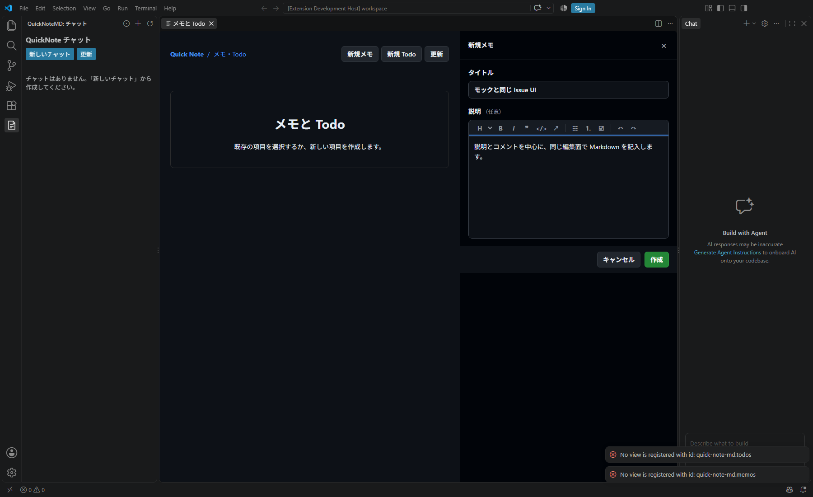
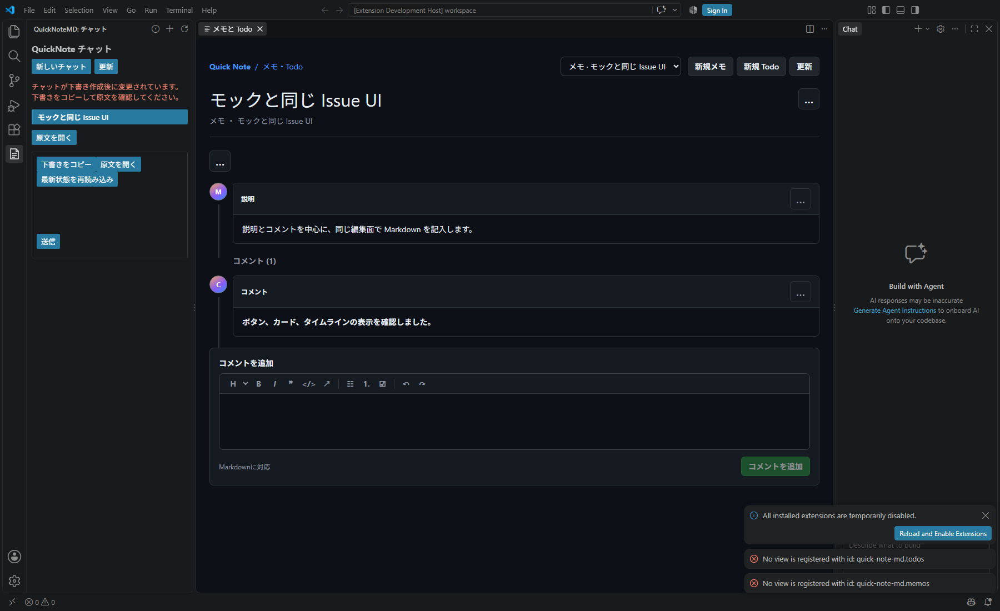

# メモ・Todo（Issue 風 UI）操作手順

この手順書では、QuickNoteMD の画面からメモと Todo を作成し、説明・ラベル・コメントを管理する方法を説明します。

> 現在の Issue 画面は、VS Code の**エディター領域**に開きます。作成フォームは画面右側のパネルです。VS Code のサイドバーだけで操作を完結する UI は、別途対応予定です。

## 1. Issue 画面を開く

1. ワークスペースを VS Code で開きます。
2. アクティビティバーの **QuickNoteMD** を開きます。
3. **QuickNoteMD: メモと Todo を開く** ボタンを選びます。コマンドパレットから同名のコマンドを実行しても開けます。
4. Issue 画面はエディター領域に表示されます。上部の項目選択から既存のメモまたは Todo を切り替えられます。

## 2. メモまたは Todo を作成する

1. 上部の **新規メモ** または **新規 Todo** を選びます。
2. 画面右側の作成パネルでタイトルを入力します。説明は任意です。
3. 説明欄では、入力しながら Markdown の書式を確認できます。ツールバーのボタンで見出し、太字、斜体、引用、コード、リンク、リスト、チェックリストを設定できます。
4. **作成** を選びます。作成をやめる場合は **キャンセル** または右上の **×** を選びます。

## 3. 詳細・コメントを確認する

選択中の項目の詳細では、タイトル、状態（Todo のみ）、ラベル、説明、コメント履歴を確認できます。新しいコメントは詳細下部の **コメントを追加** 欄に入力し、**コメントを追加** で保存します。コメントも説明と同じ Markdown ツールバーを使えます。

## 4. タイトル・説明・コメントを編集する

- **タイトル**: タイトル横の **…** → **タイトルを編集**。保存するとタイトルが変わります。
- **説明**: 説明カード右上の **…** → **説明を編集**。カード内の編集欄で Markdown を変更し、**保存** または **キャンセル** を選びます。
- **コメント**: 対象コメントカード右上の **…** から編集または削除を選びます。編集内容は対象コメントにだけ反映されます。

保存に失敗した場合は画面にエラーが表示されます。入力が残っていることを確認して、必要に応じて修正後に再度保存してください。

## 5. ラベルと Todo の状態を変更する

1. 状態・ラベル欄の **…** を選び、**ラベルを追加** または **ラベルを編集** を選びます。
2. ラベル名を入力して **追加** を選びます。追加後に **適用** を選ぶと保存されます。保存せずに戻る場合は **キャンセル** を選びます。
3. Todo の状態はラベルの左側にある状態選択から変更します。状態選択は Todo にのみ表示され、メモには表示されません。

## 保存について

- 項目は Markdown ファイルに保存され、再度開いたときも内容を引き継ぎます。
- メモと Todo は同じ画面で扱いますが、メモに Todo の状態は追加されません。
- メモ本文のチェックリストはメモの内容として保存され、独立した Todo として扱われません。
- チャット履歴や `todo.md` はメモ一覧には表示されません。
